<div align="center">

# 🚀 End-to-End CI/CD Pipeline with Kubernetes Monitoring

### Flask · MySQL — built by Jenkins, deployed to Kind, monitored with Prometheus and Grafana

<br>


<br>

[Screenshots](#-project-screenshots) •
[About](#-about-the-project) •
[Architecture](#-architecture) •
[Tech Stack](#-tech-stack) •
[Getting Started](#-getting-started) •
[Learnings](#-challenges--learnings)

</div>

---

## 📸 Project Screenshots


### 🔁 Part 1 · CI/CD Execution

> From `git push` to a live deployment, fully automated.

<table>
  <tr>
    <td align="center" width="50%">
      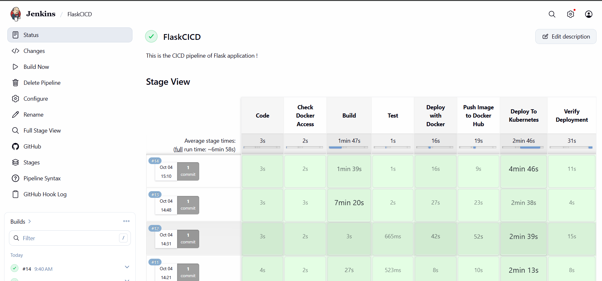<br>
      <b>1. Jenkins Stages</b>
    </td>
    <td align="center" width="50%">
      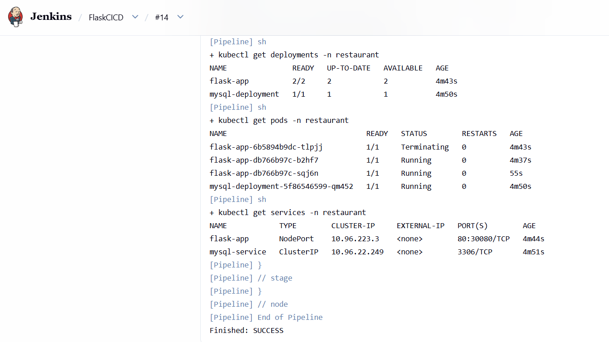<br>
      <b>2. Jenkins Pipeline Console</b>
    </td>
  </tr>
  <tr>
    <td align="center" width="50%">
      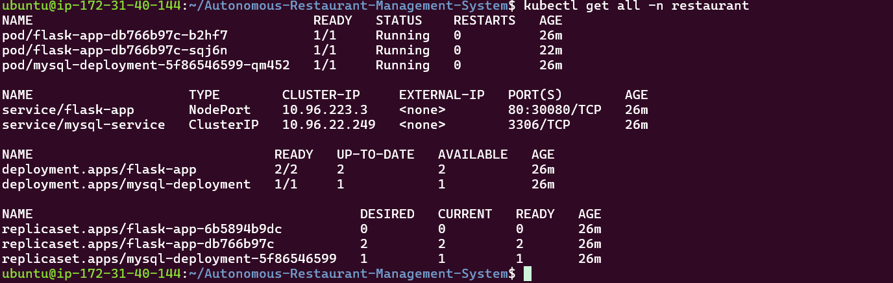<br>
      <b>3. Kubernetes Console</b>
    </td>
    <td align="center" width="50%">
      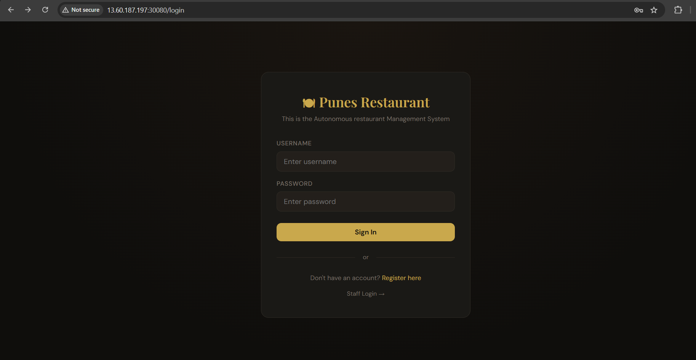<br>
      <b>4. Live UI</b>
    </td>
  </tr>
</table>

---

### 📊 Part 2 · Monitoring with Prometheus and Grafana

> Real-time visibility into the Kubernetes cluster.

<table>
  <tr>
    <td align="center" width="50%">
      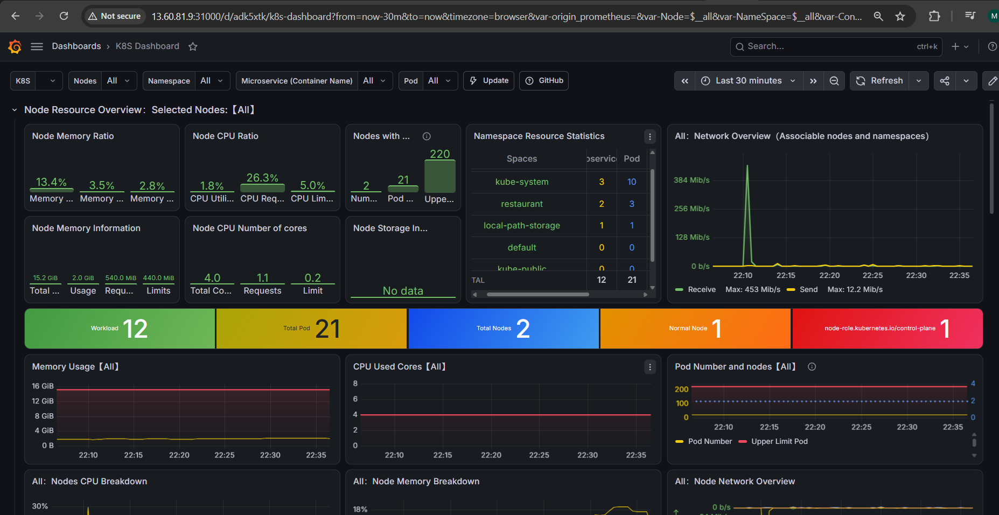<br>
      <b>1. Grafana Dashboard</b>
    </td>
    <td align="center" width="50%">
      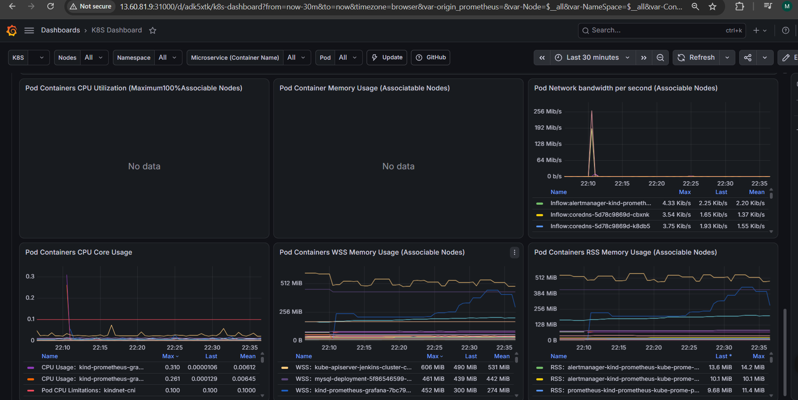<br>
      <b>2. Pods</b>
    </td>
  </tr>
</table>

<div align="center">
  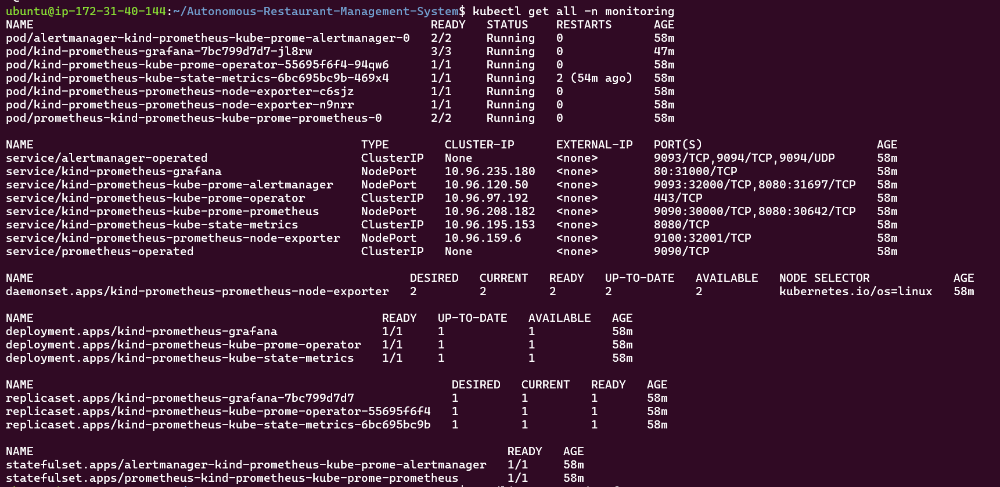
  <p><b>3. Monitoring Dashboard</b></p>
</div>

---

## 📖 About The Project

This project demonstrates a **complete, hands-free CI/CD workflow** for a containerized web application on Kubernetes, with full cluster observability.

A developer pushes code to **GitHub**. A **webhook** triggers **Jenkins**, which runs the pipeline on a dedicated **Jenkins agent** connected over **SSH key authentication**. The pipeline builds the Docker image, pushes it to the registry, deploys the Kubernetes manifests to a **Kind** cluster, and verifies the rollout. The cluster itself is monitored by **Prometheus** and **Grafana**, installed with **Helm** in a separate `monitoring` namespace.

### ✨ Highlights

| | Feature |
|---|---|
| 🔁 | End-to-end CI/CD pipeline written as code with **Jenkins** |
| 🖥️ | Pipeline executes on a **Jenkins agent**, connected with **SSH public/private keys** |
| 🪝 | **GitHub Webhook** triggers every build automatically on push |
| ☸️ | Kubernetes cluster created locally with **Kind** |
| ⚡ | **One pipeline** handles build, image push, deployment and manifest verification |
| 🎨 | Change the UI, push to GitHub, and the **new UI appears in the browser** with no manual steps |
| 🔐 | MySQL credentials managed with Kubernetes **Secrets** |
| 💾 | Persistent MySQL storage using a **PVC** |
| 📦 | **Prometheus and Grafana** installed with **Helm** |
| 🗂️ | Dedicated **`monitoring` namespace** with pods, deployments and services |
| 📈 | **Grafana dashboards** for Kubernetes metrics, opened through service ports |

---

## 🏗️ Architecture

The project has **two simple parts**: an automated **delivery pipeline** that ships the code, and a **Kubernetes cluster** that runs and monitors the application.

### 1️⃣ Delivery Pipeline (CI/CD)

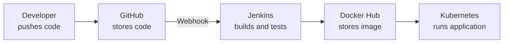

### 2️⃣ Application and Monitoring (inside Kubernetes)

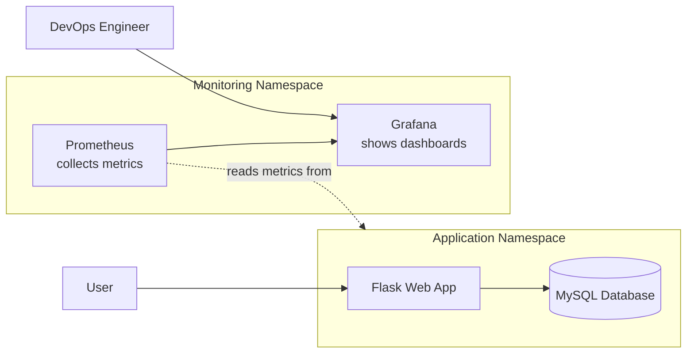

### 📝 How It Works

| Step | What happens | Tool |
|:----:|--------------|------|
| 1 | A developer pushes code to the repository | **GitHub** |
| 2 | GitHub automatically notifies Jenkins (no manual trigger) | **Webhook** |
| 3 | Jenkins builds a Docker image of the application | **Jenkins + Docker** |
| 4 | The image is uploaded to a registry | **Docker Hub** |
| 5 | The new version is deployed and verified on the cluster | **Kubernetes (Kind)** |
| 6 | Users open the updated application in the browser | **Flask + MySQL** |
| 7 | Cluster health is collected and displayed on dashboards | **Prometheus + Grafana** |

> **In short:** push code → the pipeline runs by itself → the new version goes live → dashboards show the cluster is healthy.

---

## 🧰 Tech Stack

| Layer | Tools |
|-------|-------|
| **Application** | Python, Flask, HTML, CSS |
| **Database** | MySQL |
| **Containers** | Docker, Docker Hub |
| **CI/CD** | Jenkins (pipeline + SSH agent), GitHub Webhooks |
| **Orchestration** | Kubernetes on Kind |
| **Packaging** | Helm 3 |
| **Monitoring** | Prometheus, Grafana |
| **Security** | SSH key authentication, Jenkins Credentials, Kubernetes Secrets |
| **Scripting** | Bash |

---

## 📂 Project Structure

```bash
.
├── 🐍 app.py                     # Flask application entry point
├── ⚙️ config.py                  # App and DB configuration
├── 🗄️ models.py                  # Database models
├── 📄 database.sql               # MySQL schema
├── 📦 requirements.txt           # Python dependencies
├── 🐳 dockerfile                 # Docker image definition
├── 🔁 Jenkinsfile                # CI/CD pipeline
├── 🎨 templates/
│   ├── login.html
│   ├── register.html
│   ├── customer_dashboard.html
│   ├── staff_login.html
│   └── staff_dashboard.html
├── 🎨 static/css/
│   └── style.css
├── ☸️ k8s/
│   ├── namespace.yml
│   ├── mysql-secret.yml
│   ├── pvc.yml
│   ├── mysql-deployment.yml
│   ├── mysql-service.yml
│   ├── flask-deployment.yml
│   └── flask-service.yml
├── 🧱 kind-cluster/
│   ├── config.yml
│   ├── install_kind.sh
│   └── install_kubectl.sh
├── 🖼️ docs/
│   ├── architecture.png
│   └── screenshots/
├── .dockerignore
├── .gitignore
└── README.md
```

> 💡 Adjust file names to match your repository.

---

## ✅ Prerequisites

| Tool | Purpose |
|------|---------|
| 🧑‍🔧 **Jenkins** | CI/CD controller (plus one agent machine) |
| 🐳 **Docker** | Build images and run Kind nodes |
| 🧱 **Kind** | Local Kubernetes cluster |
| ☸️ **kubectl** | Interact with the cluster |
| ⛵ **Helm 3** | Install Prometheus and Grafana |
| 🐙 **Git / GitHub** | Source control and webhook |

A **Docker Hub** account is also required for the image registry.

Set these variables once and reuse them below:

```bash
export DOCKER_USER=<your-dockerhub-username>
export IMAGE_NAME=$DOCKER_USER/<app-image-name>
export CLUSTER_NAME=<kind-cluster-name>
export APP_NAMESPACE=<app-namespace>
export JENKINS_IP=<jenkins-public-ip>
```

---

## 🚀 Getting Started

### 🔹 Step 1 · Create the Kind Cluster

```bash
cd kind-cluster
chmod +x install_kubectl.sh install_kind.sh
./install_kubectl.sh
./install_kind.sh

kind create cluster --config config.yml --name $CLUSTER_NAME

kubectl get nodes
```

<!-- 📸 Add screenshot: docs/screenshots/kubectl-resources.png -->

---

### 🔹 Step 2 · Dockerize the Application

The Flask app is packaged as a single image. MySQL uses the official image and receives its credentials at runtime from a Kubernetes Secret.

| Image | Base | Port | Purpose |
|-------|------|------|---------|
| `<dockerhub-user>/<app-image>` | python slim | 5000 | Flask app and templates |
| `mysql` (official) | mysql | 3306 | Database |

<details>
<summary><b>🐍 Example Dockerfile</b></summary>

```dockerfile
FROM python:3.13-slim
WORKDIR /app
COPY requirements.txt .
RUN pip install --no-cache-dir -r requirements.txt
COPY . .
EXPOSE 5000
CMD ["python", "app.py"]
```

</details>

> 🔒 Credentials are **never** baked into an image. Flask and MySQL read them from a Kubernetes Secret.

---

### 🔹 Step 3 · Configure the Jenkins Agent (SSH Keys)

The pipeline runs on a dedicated agent instead of the controller.

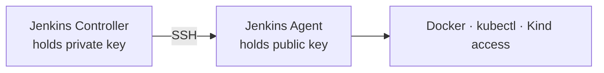

1. **Generate a key pair**
   ```bash
   ssh-keygen -t rsa -b 4096
   ```
2. **Add the public key** to `~/.ssh/authorized_keys` on the agent machine.
3. **Add the private key** in Jenkins: *Manage Jenkins → Credentials → SSH Username with private key*.
4. **Create the node**: *Manage Jenkins → Nodes → New Node → Launch agents via SSH*. Enter the agent IP, select the credential, and set a label such as `agent1`.
5. **Install on the agent:** Docker, kubectl, and access to the Kind cluster.
6. **Add Docker Hub credentials** in Jenkins with the ID `dockerhub-creds`.

<!-- 📸 Add screenshot: docs/screenshots/jenkins-agent.png -->

---

### 🔹 Step 4 · Set Up the GitHub Webhook

1. GitHub repository → **Settings → Webhooks → Add webhook**
2. **Payload URL:** `http://<JENKINS_IP>:8080/github-webhook/`
3. **Content type:** `application/json`
4. **Event:** Just the push event
5. In the Jenkins job, enable **GitHub hook trigger for GITScm polling**

<!-- 📸 Add screenshot: docs/screenshots/github-webhook.png -->

---

### 🔹 Step 5 · Create the Jenkins Pipeline

1. **New Item → Pipeline**
2. Definition: **Pipeline script from SCM** → Git → your repository URL → branch `main`
3. Script path: `Jenkinsfile`
4. Save, then push a commit. The pipeline starts on its own.

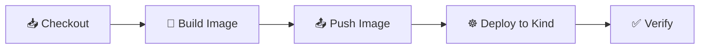

| Stage | What happens |
|-------|--------------|
| 📥 **Checkout** | Pulls the latest code from GitHub |
| 🐳 **Build Image** | Builds the Flask image from the `dockerfile` |
| 📤 **Push Image** | Pushes the tagged image to Docker Hub |
| ☸️ **Deploy** | Applies the manifests in `k8s/` |
| ✅ **Verify** | Checks rollout status, pods and services |

<details>
<summary><b>📄 Example <code>Jenkinsfile</code></b></summary>

```groovy
pipeline {
    agent { label 'agent1' }

    environment {
        IMAGE = "<dockerhub-user>/<app-image>"
        TAG   = "${BUILD_NUMBER}"
    }

    stages {
        stage('Checkout') {
            steps { checkout scm }
        }
        stage('Build Image') {
            steps { sh 'docker build -t $IMAGE:$TAG -t $IMAGE:latest .' }
        }
        stage('Push Image') {
            steps {
                withCredentials([usernamePassword(credentialsId: 'dockerhub-creds',
                                 usernameVariable: 'USER', passwordVariable: 'PASS')]) {
                    sh '''
                      echo $PASS | docker login -u $USER --password-stdin
                      docker push $IMAGE:$TAG
                      docker push $IMAGE:latest
                    '''
                }
            }
        }
        stage('Deploy to Kubernetes') {
            steps {
                sh '''
                  kubectl apply -f k8s/
                  kubectl set image deployment/<flask-deployment> <container>=$IMAGE:$TAG -n <app-namespace>
                '''
            }
        }
        stage('Verify') {
            steps {
                sh '''
                  kubectl rollout status deployment/<flask-deployment> -n <app-namespace>
                  kubectl get pods,svc -n <app-namespace>
                '''
            }
        }
    }
}
```

</details>

<!-- 📸 Add screenshot: docs/screenshots/jenkins-pipeline.png -->

---

### 🔹 Step 6 · Application Manifests

The pipeline applies these automatically. To apply them manually:

**1️⃣ Namespace**

```bash
kubectl apply -f k8s/namespace.yml
```

**2️⃣ MySQL: Secret, PVC, Deployment, Service**

> ⚠️ **Never commit real credentials.** Create the secret with kubectl instead:

```bash
kubectl create secret generic mysql-secret \
  --from-literal=MYSQL_ROOT_PASSWORD=<password> \
  -n $APP_NAMESPACE
```

```bash
kubectl apply -f k8s/pvc.yml
kubectl apply -f k8s/mysql-deployment.yml
kubectl apply -f k8s/mysql-service.yml
```

**3️⃣ Flask**

```bash
kubectl apply -f k8s/flask-deployment.yml
kubectl apply -f k8s/flask-service.yml
```

Flask reaches MySQL through the in-cluster service DNS name, with credentials injected from the Secret.

**4️⃣ Open the app**

```bash
kubectl get svc -n $APP_NAMESPACE
# NodePort:      http://<node-ip>:<nodeport>
# Port-forward:  kubectl port-forward svc/<flask-service> 5000:5000 -n $APP_NAMESPACE
```

### 🔥 Live Update Demo

1. Edit `templates/login.html`
2. `git commit` and `git push`
3. The webhook triggers Jenkins, which builds and deploys the new version
4. Refresh the browser to see the new UI ✨

<!-- 📸 Add screenshot: docs/screenshots/ui-before-after.png -->

---

### 🔹 Step 7 · Monitoring with Prometheus and Grafana (Helm)

Both tools live in their own namespace, away from the application.

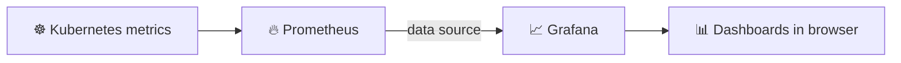

**7.1 · Create the namespace and add the Helm repos**

```bash
kubectl create namespace monitoring

helm repo add prometheus-community https://prometheus-community.github.io/helm-charts
helm repo add grafana https://grafana.github.io/helm-charts
helm repo update
```

**7.2 · Install Prometheus and Grafana**

```bash
helm install prometheus prometheus-community/prometheus -n monitoring
helm install grafana grafana/grafana -n monitoring
```

**7.3 · Expose them through service ports**

```bash
kubectl expose service prometheus-server -n monitoring \
  --type=NodePort --target-port=9090 --name=prometheus-server-ext

kubectl expose service grafana -n monitoring \
  --type=NodePort --target-port=3000 --name=grafana-ext

kubectl get svc -n monitoring
```

**7.4 · Get the Grafana admin password**

```bash
kubectl get secret grafana -n monitoring \
  -o jsonpath="{.data.admin-password}" | base64 --decode; echo
```

**7.5 · Connect Grafana to Prometheus and import a dashboard**

1. Open Grafana → **Connections → Data sources → Add data source → Prometheus**
2. URL: `http://prometheus-server.monitoring.svc.cluster.local`
3. **Dashboards → Import**, then use a Kubernetes dashboard ID such as `315` or `6417`

| Tool | URL |
|------|-----|
| 🔥 **Prometheus** | `http://<node-ip>:<prometheus-nodeport>` |
| 📈 **Grafana** | `http://<node-ip>:<grafana-nodeport>` |

<!-- 📸 Add screenshots: docs/screenshots/monitoring-namespace.png, prometheus.png, grafana-dashboard.png -->

---

## 🔍 Verification

```bash
kubectl get nodes
kubectl get pods -n $APP_NAMESPACE
kubectl get svc  -n $APP_NAMESPACE
kubectl get pvc  -n $APP_NAMESPACE
kubectl get all  -n monitoring
kubectl logs deploy/<flask-deployment> -n $APP_NAMESPACE
```

| Check | Expected result |
|-------|-----------------|
| Jenkins build | All stages green after a push |
| Webhook | Recent delivery shows `200` |
| App pods | All `Running` |
| PVC | `Bound` |
| Monitoring pods | All `Running` in `monitoring` namespace |
| Browser | App, Prometheus and Grafana all load |

---

## 🧠 Challenges & Learnings

Replace these with your own experience. These are common issues on this setup:

<details>
<summary><b>🔴 Jenkins agent fails to connect over SSH</b></summary>

<br>

**Cause:** Wrong private key format, missing public key on the agent, or host key verification settings.
**Fix:** Regenerated the key pair, added the public key to `authorized_keys`, and re-added the credential in Jenkins.

</details>

<details>
<summary><b>🔴 GitHub webhook not triggering builds</b></summary>

<br>

**Cause:** Jenkins not reachable from the internet, wrong payload URL, or the trigger not enabled in the job.
**Fix:** Opened the Jenkins port, used the `/github-webhook/` URL, and enabled the GitHub hook trigger.

</details>

<details>
<summary><b>🔴 Pipeline cannot reach the Kind cluster</b></summary>

<br>

**Cause:** The agent had no kubeconfig for the cluster, or Docker permissions were missing for the Jenkins user.
**Fix:** Copied the kubeconfig to the agent user and added that user to the `docker` group.

</details>

<details>
<summary><b>🔴 <code>ImagePullBackOff</code> after deployment</b></summary>

<br>

**Cause:** Wrong image name or tag, or the image was not pushed.
**Fix:** Verified the image and tag in the manifest and in Docker Hub.

</details>

<details>
<summary><b>🔴 Flask unable to reach MySQL</b></summary>

<br>

**Cause:** Wrong service name, MySQL still starting, or incorrect Secret keys.
**Fix:** Used the in-cluster service DNS name and matched the Secret keys with the deployment.

</details>

<details>
<summary><b>🔴 Prometheus or Grafana not reachable in the browser</b></summary>

<br>

**Cause:** Services were `ClusterIP` and the Kind node ports were not mapped.
**Fix:** Exposed them as `NodePort` and added the port mappings in the Kind `config.yml` (or used `kubectl port-forward`).

</details>

### 🎓 Key Takeaways

- ✅ How to build a full CI/CD pipeline with Jenkins and a separate agent
- ✅ How SSH public/private keys secure controller-to-agent communication
- ✅ How GitHub webhooks remove manual build triggers
- ✅ How Kind provides a fast local Kubernetes environment
- ✅ How Helm installs a complete monitoring stack in one command
- ✅ How Prometheus and Grafana give real visibility into cluster health

---

## 🧹 Cleanup

```bash
helm uninstall prometheus -n monitoring
helm uninstall grafana -n monitoring
kubectl delete namespace monitoring

kubectl delete -f k8s/
kind delete cluster --name $CLUSTER_NAME
```

---

## 🔮 Future Improvements

- [ ] Ingress with the NGINX controller
- [ ] Trivy image scanning and SonarQube code quality stage
- [ ] Liveness and readiness probes
- [ ] Horizontal Pod Autoscaler
- [ ] Alertmanager notifications (Slack / Email)
- [ ] Package all manifests as a Helm chart
- [ ] GitOps with ArgoCD
- [ ] Migrate from Kind to EKS using Terraform

---

<div align="center">

## 👨‍💻 Author

**Mayur Gopal Saitwal**

[](https://github.com/MayurSaitwal)
[](https://www.linkedin.com/in/mayursaitwal)
[](mailto:mayursaitwal81@gmail.com)

<br>

⭐ **If you found this project useful, please give it a star!** ⭐

</div>
